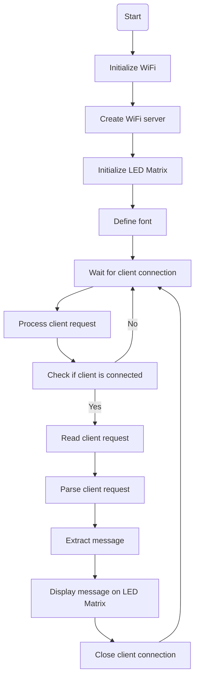

# LED Matrix Web Control

This code allows you to control an LED matrix via a webserver using a NodeMcu ESP8266. It supports a 15x7 LED matrix consisting of 2 segments. The matrix is controlled using the LEDMatrixDriver.hpp library.

## Hardware Required
1. NodeMcu ESP8266 development board
2. 15x7 LED matrix with 2 segments
3. Jumper wires

## Library Dependencies
- WiFiClient.h
- LEDMatrixDriver.hpp

## Setup
1. Input your Wi-Fi name and password in the variables `ssid` and `password` respectively.
2. The code uses a TCP server on port 80 to respond to HTTP requests. It connects the ESP8266 to your Wi-Fi network using the `WiFiClient.h` library.
3. An instance of the LEDMatrixDriver class, `lmd`, is defined to control the LED matrix. A block font of size 8x8 is created for displaying characters on the matrix.

## Usage
1. Upload the code to your NodeMcu ESP8266 development board.
2. Connect the LED matrix to the appropriate pins on the NodeMcu.
3. Power on the NodeMcu.
4. Access the IP address of the NodeMcu on your local network using a web browser.
5. The server will respond with an HTML page containing a form to input text.
6. Enter the desired text in the form and submit it.
7. The server will process the request and display the text on the LED matrix.

## Flowchart
The following flowchart illustrates the main steps of the code:

## Credits
This code is inspired by the LED matrix examples and utilizes the LEDMatrixDriver.hpp library for controlling the LED matrix.
