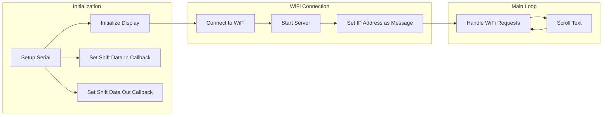

# Version One

This repository contains code that demonstrates how to use the MD_MAX72xx library to scroll text on an LED matrix display using the ESP8266 WiFi interface. The code allows users to input text through a web browser, which is then displayed as a scrolling message on the LED matrix.

## Hardware Required
- ESP8266 development board
- MD_MAX72xx-based LED matrix display
- Jumper wires

## Library Dependencies
- ESP8266WiFi.h
- SPI.h
- MD_MAX72xx.h

## Pin Connections
Make the following connections between the ESP8266 and the MD_MAX72xx display driver:

| ESP8266 | MAX7219/MAX7221 |
| ------- | --------------- |
| 3V3     | Vcc             |
| GND     | GND             |
| D7/MOSI | DATA IN         |
| D8/CS   | LOAD/CS         |
| D5/SCK  | CLK             |

Note: Adjust the pin numbers if necessary to match your hardware setup.

## Usage
1. Connect the ESP8266 development board and the MD_MAX72xx display driver according to the pin connections specified above.
2. Flash the ESP8266 with the provided code.
3. Connect your computer or mobile device to the WiFi network named "running text" using the password "12345678".
4. Open a web browser and enter the IP address displayed on the LED matrix connected to the ESP8266.
5. In the text box on the web page, enter your desired message and click the "Send Text" button. The message will start scrolling on the LED matrix.
6. To enter a new message, repeat step 5.

## Functionality
The code uses a callback function to control the scrolling text on the LED matrix. Users can input text through a web browser, and this text will be displayed as a scrolling message on the LED matrix. The IP address of the ESP8266 is shown on the scrolling display after the initialization and connection to the WiFi network.

The user enters the message in the text box on the web page, and it is sent to the ESP8266 via an HTTP GET request. The message is then displayed on the LED matrix as a scrolling message.

Additionally, the code includes a heartbeat function that toggles a GPIO pin (D2) on and off. By setting the `LED_HEARTBEAT` constant to 1, the heartbeat function can be enabled. The `HB_LED_TIME` constant can be adjusted to change the duration of the heartbeat.

For debugging purposes, the `DEBUG` constant can be set to 1 to enable debugging messages to the serial console. Similarly, the `PRINT_CALLBACK` constant can be set to 1 to print messages related to the callback function to the serial console.

## Flowchart
The flowchart below outlines the main steps and interactions in the code:

## Credits
The code in this repository is based on the Parola_ESP8266_WiFi_Scrolling example included with the MD_MAX72xx library.

The MD_MAX72xx library was created

 by Mark Stanley and is maintained by MajicDesigns.

The ESP8266WiFi.h library is part of the ESP8266 core for Arduino and was created by Ivan Grokhotkov.

The SPI.h library is part of the Arduino core for ESP8266 and was created by Cristian Maglie, Ivan Grokhotkov, Michael Miller, and Paul Stoffregen.
