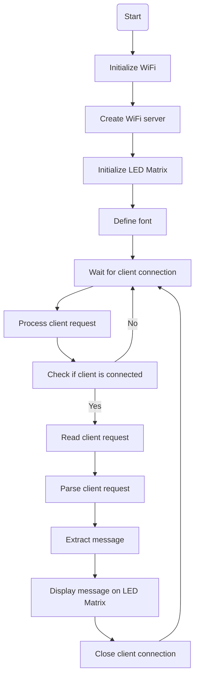

## LED Matrix Web Control using NodeMcu ESP8266
This code provides the functionality of controlling an LED matrix via a webserver using a NodeMcu ESP8266. The matrix driver used here is the LEDMatrixDriver.hpp, and the matrix is a 15x7 matrix consisting of 2 segments.

To use this code, you need to input your Wifi name and password in the variables ssid and password, respectively. The TCP server at port 80 will respond to HTTP requests, and the code uses the WiFiClient.h library for connecting the ESP8266 to the Wifi network.

The LEDMatrixDriver class instance lmd is defined to control the LED matrix, and a block font 8x8 is created to display characters on the matrix.

The code is set up to control the matrix via a webserver, allowing users to control the display by accessing the IP address of the NodeMcu on their local network. The server is set up to respond to HTTP GET requests for the root path ('/'), returning an HTML page with a form allowing users to input text to display on the matrix.

Users can input their text in the form, and the server will respond to the form submission with an HTTP POST request, displaying the text on the LED matrix.

## Flowchart 

