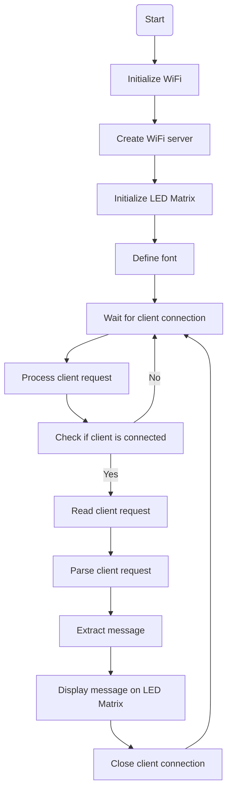

# Version Two

This project provides a code implementation for controlling an LED matrix using a web server. The code is specifically designed for the NodeMcu ESP8266 board. The LED matrix is driven by the LEDMatrixDriver library, and the communication with the web server is facilitated by the ESP8266WiFi library.

## Prerequisites
- NodeMcu ESP8266 board
- LED Matrix (compatible with LEDMatrixDriver library)
- WiFi network credentials (SSID and password)

## Hardware Setup
1. Connect the LED matrix to the NodeMcu ESP8266 board.
2. Make sure the LED matrix is compatible with the LEDMatrixDriver library and connected to the appropriate pins (e.g., CS pin).

## Software Setup
1. Install the LEDMatrixDriver library and the ESP8266WiFi library.
2. Open the code in an Arduino-compatible IDE (e.g., Arduino IDE).
3. Update the following variables in the code:
   - `ssid`: Set this to your WiFi network SSID (name).
   - `password`: Set this to your WiFi network password.

## Usage
1. Upload the code to the NodeMcu ESP8266 board.
2. Open the serial monitor to view the IP address assigned to the board.
3. Connect your computer or mobile device to the same WiFi network.
4. Open a web browser and enter the IP address displayed in the serial monitor.
5. The web page will allow you to control the LED matrix by sending text messages to display.

## Flowchart 

## Customization
- LED Matrix Dimensions: Adjust the `LEDMATRIX_WIDTH`, `LEDMATRIX_HEIGHT`, and `LEDMATRIX_SEGMENTS` variables according to your LED matrix configuration.
- Font: Customize the `font` array to define the desired characters or symbols to display on the LED matrix.

## Libraries Used
- LEDMatrixDriver: A library for controlling LED matrices.
- ESP8266WiFi: A library for connecting ESP8266 boards to WiFi networks.

## Acknowledgements
- LEDMatrixDriver library: Developed by [Bill Earl](https://github.com/bitbank2/LEDMatrixDriver).
